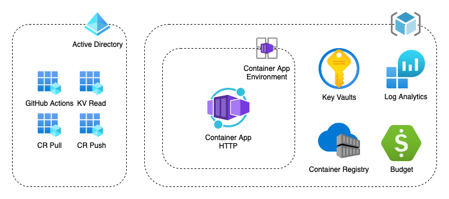

# Azure Container App examples

This project is an example of how [Azure Container App](https://docs.microsoft.com/en-us/azure/container-apps/) can be implemented and deployed. The project contains application and infrastructure code.
Application is minimal ASP .NET Core API with preconfigured code style and analyzers.
The infrastructure code is based on [Bicep](https://docs.microsoft.com/en-us/azure/azure-resource-manager/bicep/) and describes the following Azure resources:

  

## How to deploy

To provision required infrastructure and deploy the application, fork this repository and do the following steps:

* Initialize `WU_ADMIN_SERVICE_PRINCIPAL_OBJECT_ID` and `WU_ADMIN_CONTACT_EMAIL` environment variables
* Run `./deploy/init/deploy.sh` and using output set `AZURE_CREDENTIALS` GitHub secret
* Trigger `provision-infrastructure` GitHub Actions workflow. After if finishes successfully, `deploy-application` will be triggered

If everything went successfully, in Azure portal find created Container App and open Application Url.
